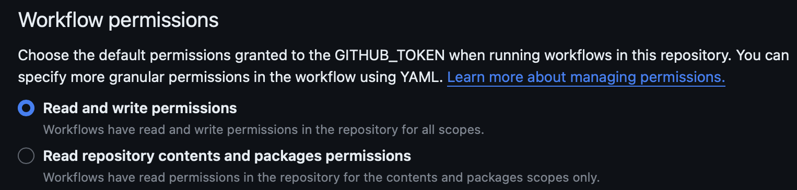
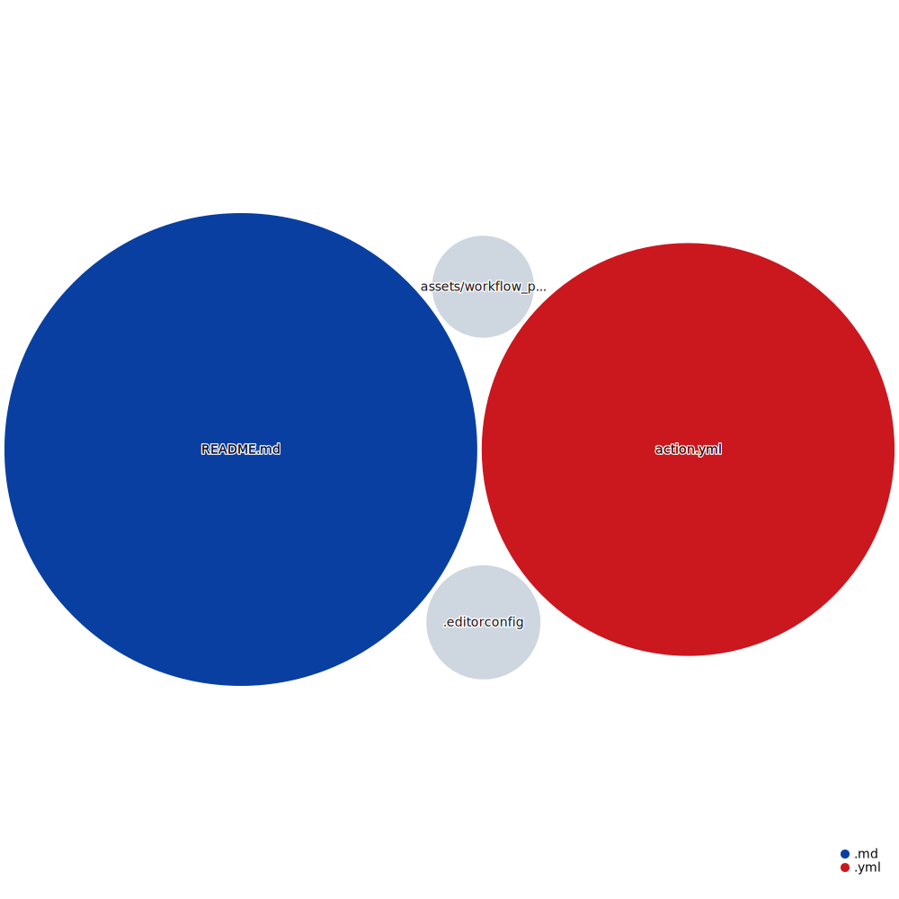

# keep-github-actions-alive-min-dependencies

GitHub action to keep Github-Actions alive but with minimal dependencies.

This GitHub Action is inspired by https://github.com/gautamkrishnar/keepalive-workflow.

## Why

GitHub will stop running your actions after 60 days of no commit activity in your repository.
After that your cron based jobs wil stop to run.

This Action helps you to avoid that :-)

## How is this accomplished

It will run as a scheduled job and if the current repository is close to the 60 day limit (or whatever time limit you specify)
the action will add an empty commit to the git repository.

## How to use

1. Go to repository settings, Click on Actions > General. Update the "Workflow permissions" to "Read and write permissions". Click on save.
    
1.
    ```yaml
    name: Github Action with a cronjob trigger
    on:
    schedule:
        - cron: "0 0 * * *"

    jobs:
    cronjob-based-github-action:
        name: Cronjob based github action
        runs-on: ubuntu-latest
        steps:
        - uses: actions/checkout@v4
        # - steps
        - uses: entepotenz/keep-github-actions-alive-min-dependencies@v1
    ```


## Options

If you use the workflow as mentioned via GitHub actions following are the options available to you to customize its behavior.

| Option | Default Value | Description | Required |
|--------|--------|--------|--------|
| `COMMIT_MESSAGE` | `GitHub Action - Workflow keepalive` | Commit message used while committing to the repo | No  |
| `COMMIT_USER_NAME` | `GitHub Action - Workflow keepalive` | Username used while committing to the repo | No |
| `COMMIT_USER_EMAIL` | `github-action-keepalive-bot@github.com` | Email id used while committing to the repo | No |
| `TIME_ELAPSED_THRESHOLD_IN_DAYS` | `50` | threshold for inactivity in the git repo which triggers keep alive commit (in days) | No |

## GitHub Next Code Visualization

[](https://mango-dune-07a8b7110.1.azurestaticapps.net/?repo=entepotenz%2Fkeep-github-actions-alive-min-dependencies)
